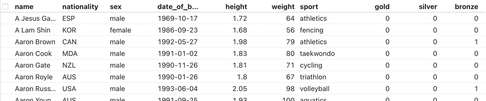

# Observable Inputs

**Observable Inputs** are lightweight user interface components — buttons, sliders, dropdowns, tables, and the like — to help you explore data and build interactive displays. Each provided input implementation returns an HTML element that exposes a _value_ property that reflects the input’s current value, and emits an _input_ event when the current value changes.

Observable Inputs is a small, free, [open-source](./LICENSE) JavaScript library that can be used in any web environment. For example, here’s how you might let the user choose a number in a vanilla web page, loading Inputs and its stylesheet from the jsDelivr CDN:

```html
<!DOCTYPE html>
<body>
<link rel="stylesheet" type="text/css" href="https://cdn.jsdelivr.net/npm/@observablehq/inputs@0.12/dist/index.css">
<script type="module">

import * as Inputs from "https://cdn.jsdelivr.net/npm/@observablehq/inputs@0.12/+esm";

// Create a numeric slider allowing a value between 0 and 100 (inclusive).
const slider = Inputs.range([0, 100], {label: "x"});

// Display the slider on the page.
document.body.append(slider);

// Listen and respond to the user dragging the slider.
slider.addEventListener("input", (event) => {
  console.log(event.target.value);
});

</script>
```

Observable Inputs are designed to be especially convenient in [Observable Framework](https://observablehq.com/framework) and [Observable notebooks](https://observablehq.com/). In Framework, use the *view* function to display an input and expose its value as a top-level [reactive variable](https://observablehq.com/framework/reactivity):

```js
const x = view(Inputs.range([0, 100]));
```

In Observable notebooks, you can similarly use the [`viewof`](https://observablehq.com/@observablehq/introduction-to-views) operator:

```js
viewof x = Inputs.range([0, 100])
```

In either case, *x* now refers reactively to the current value of the input; code that references *x* will re-run automatically when the user interacts with the input.

Observable Inputs provides basic inputs:

* [Button](#button) - do something when a button is clicked
* [Checkbox](#checkbox) - choose any from a set
* [Toggle](#toggle) - toggle between two values (on or off)
* [Radio](#radio) - choose one from a set
* [Range](#range) - choose a numeric value in a range (slider)
* [Select](#select) - choose one or many from a set (drop-down menu)
* [Text](#text) - freeform single-line text input
* [Textarea](#textarea) - freeform multi-line text input
* [Date](#date) - date input
* [File](#file) - local file input

Observable Inputs provides fancy inputs for tabular data:

* [Search](#search) - query a tabular dataset
* [Table](#table) - browse a tabular dataset

Lastly, Inputs provides low-level utilities for more advanced usage:

* [Form](#inputsforminputs-options) - combine multiple inputs
* [Input](#inputsinputvalue) - a programmatic interface for storing input state
* [bind](#inputsbindtarget-source-invalidation) - synchronize two or more inputs
* [disposal](#inputsdisposalelement) - detect when an input is discarded

## Inputs

### Button

#### Inputs.button(*content*, *options*)

[](https://observablehq.com/framework/inputs/button)

```js
Inputs.button("OK", {label: "Click me"})
```

[Source](./src/button.js) · [Examples](https://observablehq.com/framework/inputs/button) · [Notebook](https://observablehq.com/@observablehq/input-button) · A Button emits an *input* event when you click it. Buttons may be used to trigger the evaluation of cells, say to restart an animation. The given *content*, either a string or an HTML element, is displayed within the button. If *content* is not specified, it defaults to “≡”, but a more meaningful value is strongly encouraged for usability.

By default, the value of a solitary Button (when *content* is a string or HTML) is how many times it has been clicked. The *reduce* function allows you to compute the new value of the Button when clicked, given the old value. For example, to set the value as the time of last click:

```js
Inputs.button("Refresh", {value: null, reduce: () => Date.now()})
```

If *content* is an array or iterable, then multiple buttons will be generated. Each element in *content* should be a tuple [*contenti*, *reducei*], where *contenti* is the content for the given button (a string or HTML), and *reducei* is the function to call when that button is clicked. For example, to have a counter that you can increment, decrement, or reset to zero:

```js
Inputs.button([
  ["Increment", (value) => value + 1],
  ["Decrement", (value) => value - 1],
  ["Reset", () => 0]
], {label: "Counter", value: 0})
```

The available *options* are:

* *label* - a label; either a string or an HTML element.
* *required* - if true, the initial value defaults to undefined.
* *value* - the initial value; defaults to 0 or null if *required* is false.
* *reduce* - a function to update the value on click; by default returns *value* + 1.
* *width* - the width of the input (not including the label).
* *disabled* - whether input is disabled; defaults to false.

### Checkbox

#### Inputs.checkbox(*data*, *options*)

[](https://observablehq.com/framework/inputs/checkbox)

```js
Inputs.checkbox(["Salty", "Spicy", "Sour", "Umami"], {label: "Flavor"})
```

[Source](./src/checkbox.js) · [Examples](https://observablehq.com/framework/inputs/checkbox) · [Notebook](https://observablehq.com/@observablehq/input-checkbox) · A Checkbox allows the user to choose any of a given set of values (any of the given elements in the iterable *data*). Unlike a [Select](#select), a Checkbox’s choices are all visible up-front. The Checkbox’s value is an array of the elements from *data* that are currently selected.

The elements in *data* need not be strings; they can be anything. To customize display, optional *keyof* and *valueof* functions may be given; the result of the *keyof* function for each element in *data* is displayed to the user, while the result of the *valueof* function is exposed in the Checkbox’s value when selected. If *data* is a Map, the *keyof* function defaults to the map entry’s key (`([key]) => key`) and the *valueof* function defaults to the map entry’s value (`([, value]) => value`); otherwise, both *keyof* and *valueof* default to the identity function (`d => d`). For example, with [d3.group](https://github.com/d3/d3-array/blob/master/README.md#group):

```js
Inputs.checkbox(d3.group(athletes, (d) => d.sport))
```

Keys may be sorted and uniqued via the *sort* and *unique* options, respectively. Elements in *data* are formatted via an optional *format* function which has the same defaults as *keyof*. As with the *label* option, the *format* function may return either a string or an HTML element.

The available *options* are:

* *label* - a label; either a string or an HTML element.
* *sort* - true, “ascending”, “descending”, or a comparator function to sort keys; defaults to false.
* *unique* - true to only show unique keys; defaults to false.
* *locale* - the current locale; defaults to English.
* *format* - a format function; defaults to [formatLocaleAuto](#formatLocaleAuto) composed with *keyof*.
* *keyof* - a function to return the key for the given element in *data*.
* *valueof* - a function to return the value of the given element in *data*.
* *value* - the initial value, an array; defaults to an empty array (no selection).
* *disabled* - whether input is disabled, or the disabled values; defaults to false.

### Toggle

#### Inputs.toggle(*options*)

```js
Inputs.toggle({label: "Mute"})
```

[Source](./src/checkbox.js) · [Examples](https://observablehq.com/framework/inputs/toggle) · [Notebook](https://observablehq.com/@observablehq/input-toggle) · A Toggle is a solitary checkbox. By default, the Toggle’s value is whether the checkbox is checked (true or false); a *values* = [*on*, *off*] option can be specified to toggle between two arbitrary values.

The available *options* are:

* *label* - a label; either a string or an HTML element.
* *values* - the two values to toggle between; defaults to [true, false].
* *value* - the initial value; defaults to the second value (false).
* *disabled* - whether input is disabled; defaults to false.

### Radio

#### Inputs.radio(*data*, *options*)

[](https://observablehq.com/framework/inputs/radio)

```js
Inputs.radio(["red", "green", "blue"], {label: "Color"})
```

[Source](./src/checkbox.js) · [Examples](https://observablehq.com/framework/inputs/radio) · [Notebook](https://observablehq.com/@observablehq/input-radio) · A Radio allows the user to choose one of a given set of values. Unlike a [Select](#select), a Radio’s choices are all visible up-front. The Radio’s value is an element from *data*, or null if no choice has been made.

The elements in *data* need not be strings; they can be anything. To customize display, optional *keyof* and *valueof* functions may be given; the result of the *keyof* function for each element in *data* is displayed to the user, while the result of the *valueof* function is exposed as the Radio’s value when selected. If *data* is a Map, the *keyof* function defaults to the map entry’s key (`([key]) => key`) and the *valueof* function defaults to the map entry’s value (`([, value]) => value`); otherwise, both *keyof* and *valueof* default to the identity function (`(d) => d`). For example, with [d3.group](https://github.com/d3/d3-array/blob/master/README.md#group):

```js
Inputs.radio(d3.group(athletes, (d) => d.sport))
```

Keys may be sorted and uniqued via the *sort* and *unique* options, respectively. Elements in *data* are formatted via an optional *format* function which has the same defaults as *keyof*. As with the *label* option, the *format* function may return either a string or an HTML element.

The available *options* are:

* *label* - a label; either a string or an HTML element.
* *sort* - true, “ascending”, “descending”, or a comparator function to sort keys; defaults to false.
* *unique* - true to only show unique keys; defaults to false.
* *locale* - the current locale; defaults to English.
* *format* - a format function; defaults to [formatLocaleAuto](#formatLocaleAuto) composed with *keyof*.
* *keyof* - a function to return the key for the given element in *data*.
* *valueof* - a function to return the value of the given element in *data*.
* *value* - the initial value; defaults to null (no selection).
* *disabled* - whether input is disabled, or the disabled values; defaults to false.

### Range

#### Inputs.range(*extent*, *options*)

[](https://observablehq.com/framework/inputs/range)

```js
Inputs.range([0, 100], {step: 1, label: "Intensity"})
```

[Source](./src/range.js) · [Examples](https://observablehq.com/framework/inputs/range) · [Notebook](https://observablehq.com/@observablehq/input-range) · A Range input specifies a number between the given *extent* = [*min*, *max*] (inclusive). If an *extent* is not specified, it defaults to [0, 1]. The chosen number can be adjusted roughly with a slider, or precisely by typing a number.

The available *options* are:

* *label* - a label; either a string or an HTML element.
* *step* - the step (precision); the interval between adjacent values.
* *format* - a format function; defaults to [formatTrim](#formatTrim).
* *placeholder* - a placeholder string for when the input is empty.
* *transform* - an optional non-linear transform.
* *invert* - the inverse transform.
* *validate* - a function to check whether the number input is valid.
* *value* - the initial value; defaults to (*min* + *max*) / 2.
* *width* - the width of the input (not including the label).
* *disabled* - whether input is disabled; defaults to false.

The given *value* is clamped to the given extent, and rounded if *step* is defined. However, note that the *min*, *max* and *step* options affect only the slider behavior, the number input’s buttons, and whether the browser shows a warning if a typed number is invalid; they do not constrain the typed number.

If *validate* is not defined, [*number*.checkValidity](https://html.spec.whatwg.org/multipage/form-control-infrastructure.html#dom-cva-checkvalidity) is used. While the input is not considered valid, changes to the input will not be reported.

The *format* function should return a string value that is compatible with native number parsing. Hence, the default [formatTrim](#formatTrim) is recommended.

If a *transform* function is specified, an inverse transform function *invert* is strongly recommended. If *invert* is not provided, the Range will fallback to Newton’s method, but this may be slow or inaccurate. Passing Math.sqrt, Math.log, or Math.exp as a *transform* will automatically supply the corresponding *invert*. If *min* is greater than *max*, *i.e.* if the extent is inverted, then *transform* and *invert* will default to `(value) => -value`.

#### Inputs.number([*extent*, ]*options*)

Equivalent to Inputs.range, except the range input is suppressed; only a number input is shown. If only *options* are specified, the *extent* defaults to [-Infinity, Infinity].

### Search

#### Inputs.search(*data*, *options*)

[](https://observablehq.com/framework/inputs/search)

```js
Inputs.search(athletes, {label: "Athletes"})
```

[Source](./src/search.js) · [Examples](https://observablehq.com/framework/inputs/search) · [Notebook](https://observablehq.com/@observablehq/input-search) · A Search input allows freeform, full-text search of an in-memory tabular dataset or an iterable (column) of values using a simple query parser. It is often used in conjunction with a [Table](#table). The value of a Search is an array of elements from the iterable *data* that match the current query. If the query is currently empty, the search input’s value is all elements in *data*.

A Search input can work with either tabular data (an array of objects) or a single column (an array of strings). When searching tabular input, all properties on each object in *data* are searched by default, but you can limit the search to a specific set of properties using the *column* option. For example, to only search the “sport” and “nationality” column:

```js
Inputs.search(athletes, {label: "Athletes", columns: ["sport", "nationality"]})
```

For example, to search U.S. state names:

```js
Inputs.search(["Alabama", "Alaska", "Arizona", "Arkansas", "California", …], {label: "State"})
```

The available *options* are:

* *label* - a label; either a string or an HTML element.
* *query* - the initial search terms; defaults to the empty string.
* *placeholder* - a placeholder string for when the query is empty.
* *columns* - an array of columns to search; defaults to *data*.columns.
* *locale* - the current locale; defaults to English.
* *format* - a function to show the number of results.
* *spellcheck* - whether to activate the browser’s spell-checker.
* *autocomplete* - the [autocomplete](https://developer.mozilla.org/en-US/docs/Web/HTML/Attributes/autocomplete) attribute, as text or boolean (true for on, false for off).
* *autocapitalize* - the [autocapitalize](https://developer.mozilla.org/en-US/docs/Web/HTML/Global_attributes/autocapitalize) attribute, as text or boolean (true for on, false for off).
* *filter* - the filter factory: a function that receives the query and returns a filter.
* *width* - the width of the input (not including the label).
* *datalist* - an iterable of suggested values.
* *disabled* - whether input is disabled; defaults to false.
* *required* - if true, the search’s value is all *data* if no query; defaults to true.

If a *filter* function is specified, it is invoked whenever the query changes; the function it returns is then passed each element from *data*, along with its zero-based index, and should return a truthy value if the given element matches the query. The default filter splits the current query into space-separated tokens and checks that each token matches the beginning of at least one string in the data’s columns, case-insensitive. For example, the query [hello world] will match the string “Worldwide Hello Services” but not “hello”.

### Select

#### Inputs.select(*data*, *options*)

[](https://observablehq.com/framework/inputs/select)

```js
Inputs.select(["Small", "Medium", "Large"], {label: "Size"})
```
```js
Inputs.select(["cyan", "magenta", "yellow", "black"], {multiple: true, label: "Inks"})
```

[Source](./src/select.js) · [Examples](https://observablehq.com/framework/inputs/select) · [Notebook](https://observablehq.com/@observablehq/input-select) · A Select allows the user to choose one of a given set of values (one of the given elements in the iterable *data*); or, if desired, multiple values may be chosen. Unlike a [Radio](#radio), only one (or a few) choices are visible up-front, affording a compact display even when many options are available. If multiple choice is allowed via the *multiple* option, the Select’s value is an array of the elements from *data* that are currently selected; if single choice is required, the Select’s value is an element from *data*, or null if no choice has been made.

The elements in *data* need not be strings; they can be anything. To customize display, optional *keyof* and *valueof* functions may be given; the result of the *keyof* function for each element in *data* is displayed to the user, while the result of the *valueof* function is exposed as the Select’s value when selected. If *data* is a Map, the *keyof* function defaults to the map entry’s key (`([key]) => key`) and the *valueof* function defaults to the map entry’s value (`([, value]) => value`); otherwise, both *keyof* and *valueof* default to the identity function (`(d) => d`). For example, with [d3.group](https://github.com/d3/d3-array/blob/master/README.md#group):

```js
Inputs.select(d3.group(athletes, (d) => d.sport))
```

Keys may be sorted and uniqued via the *sort* and *unique* options, respectively. Elements in *data* are formatted via an optional *format* function which has the same defaults as *keyof*. While the *label* option may be either a string or an HTML element, the *format* function must return a string (unlike a Radio).

The available *options* are:

* *label* - a label; either a string or an HTML element.
* *multiple* - whether to allow multiple choice; defaults to false.
* *size* - if *multiple* is true, the number of options to show.
* *sort* - true, “ascending”, “descending”, or a comparator function to sort keys; defaults to false.
* *unique* - true to only show unique keys; defaults to false.
* *locale* - the current locale; defaults to English.
* *format* - a format function; defaults to [formatLocaleAuto](#formatLocaleAuto) composed with *keyof*.
* *keyof* - a function to return the key for the given element in *data*.
* *valueof* - a function to return the value of the given element in *data*.
* *value* - the initial value, an array if multiple choice is allowed.
* *width* - the width of the input (not including the label).
* *disabled* - whether input is disabled, or the disabled values; defaults to false.

### Table

#### Inputs.table(*data*, *options*)

[](https://observablehq.com/framework/inputs/table)

[Source](./src/table.js) · [Examples](https://observablehq.com/framework/inputs/table) · [Notebook](https://observablehq.com/@observablehq/input-table) · A Table displays a tabular dataset; *data* should be an iterable of objects, such as the result of loading a CSV file. The *data* may also be a promise to the same, in which case the contents of the table will be lazily populated once the promise resolves. Each object corresponds to a row, while each field corresponds to a column. To improve performance with large datasets, the rows of the table are lazily rendered on scroll. Rows may be sorted by clicking column headers (once for ascending, then again for descending).

While intended primarily for display, a Table also serves as an input. The value of the Table is its selected rows: a filtered (and possibly sorted) view of the *data*. If the *data* is specified as a promise, while the promise is unresolved, the table’s value is undefined and attempting to set the value of the table will throw an error. Rows can be selected by clicking or shift-clicking checkboxes. See also [Search](#search), which can be used for rapid filtering of the table’s rows.

By default, the Table infers the type of each column by inspecting values, assuming that non-null values in each column have consistent types. Numbers are formatted in the specified *locale*; dates are formatted in ISO 8601 UTC. Numbers columns are further right-aligned with [tabular figures](https://practicaltypography.com/alternate-figures.html) to assist comparison. The *format* and *align* of each column can be customized as options if desired.

By default, the Table uses fixed layout if *data* has fewer than twelve columns. This improves performance and avoids reflow when scrolling due to lazily-rendered rows. If *data* has twelve or more columns, the auto layout is used instead, which automatically sizes columns based on the content. This behavior can be changed by specifying the *layout* option explicitly.

The available *options* are:

* *columns* - the columns (property names) to show; defaults to *data*.columns.
* *value* - a subset of *data* to use as the initial selection (checked rows), or a *data* item if *multiple* is false.
* *rows* - the maximum number of rows to show; defaults to 11.5.
* *sort* - the column to sort by; defaults to null (input order).
* *reverse* - whether to reverse the initial sort (descending instead of ascending).
* *format* - an object of column name to format function.
* *align* - an object of column name to “left”, “right”, or “center”.
* *header* - an object of column name to corresponding header; either a string or HTML element.
* *width* - the table width, or an object of column name to width.
* *maxWidth* - the maximum table width, if any.
* *height* - the fixed table height, if any.
* *maxHeight* - the maximum table height, if any; defaults to (*rows* + 1) * 22 - 1.
* *layout* - the [table layout](https://developer.mozilla.org/en-US/docs/Web/CSS/table-layout); defaults to fixed for ≤12 columns.
* *required* - if true, the table’s value is all *data* if no selection; defaults to true.
* *select* - if true, allows the user to modify the table’s value by selecting rows; defaults to true.
* *multiple* - if true, allow multiple rows to be selected; defaults to true.

If *width* is “auto”, the table width will be based on the table contents; note that this may cause the table to resize as rows are lazily rendered.

### Text

#### Inputs.text(*options*)

[](https://observablehq.com/framework/inputs/text)

```js
Inputs.text({label: "Name", placeholder: "Enter your name"})
```

[Source](./src/text.js) · [Examples](https://observablehq.com/framework/inputs/text) · [Notebook](https://observablehq.com/@observablehq/input-text) · A Text allows freeform single-line text input. For example, a Text might be used to allow the user to enter a search query. (See also [Search](#search).) By default, a Text will report its value immediately on input. If more deliberate behavior is desired, say if the input will trigger an expensive computation or remote API, the *submit* option can be set to true to wait until a button is clicked or the Enter key is pressed.

The available *options* are:

* *label* - a label; either a string or an HTML element.
* *type* - the [input type](https://developer.mozilla.org/en-US/docs/Web/HTML/Element/input#input_types), such as “password” or “email”; defaults to “text”.
* *value* - the initial value; defaults to the empty string.
* *placeholder* - the [placeholder](https://developer.mozilla.org/en-US/docs/Web/HTML/Attributes/placeholder) attribute.
* *spellcheck* - whether to activate the browser’s spell-checker.
* *autocomplete* - the [autocomplete](https://developer.mozilla.org/en-US/docs/Web/HTML/Attributes/autocomplete) attribute, as text or boolean (true for on, false for off).
* *autocapitalize* - the [autocapitalize](https://developer.mozilla.org/en-US/docs/Web/HTML/Global_attributes/autocapitalize) attribute, as text or boolean (true for on, false for off).
* *pattern* - the [pattern](https://developer.mozilla.org/en-US/docs/Web/HTML/Attributes/pattern) attribute.
* *minlength* - [minimum length](https://developer.mozilla.org/en-US/docs/Web/HTML/Attributes/minlength) attribute.
* *maxlength* - [maximum length](https://developer.mozilla.org/en-US/docs/Web/HTML/Attributes/maxlength) attribute.
* *min* - [minimum value](https://developer.mozilla.org/en-US/docs/Web/HTML/Attributes/min) attribute; formatted appropriately, *e.g.* yyyy-mm-dd for the date type.
* *max* - [maximum value](https://developer.mozilla.org/en-US/docs/Web/HTML/Attributes/max) attribute.
* *required* - if true, the input must be non-empty; defaults to *minlength* > 0.
* *validate* - a function to check whether the text input is valid.
* *width* - the width of the input (not including the label).
* *submit* - whether to require explicit submission before updating; defaults to false.
* *datalist* - an iterable of suggested values.
* *readonly* - whether input is readonly; defaults to false.
* *disabled* - whether input is disabled; defaults to false.

If *validate* is not defined, [*text*.checkValidity](https://html.spec.whatwg.org/multipage/form-control-infrastructure.html#dom-cva-checkvalidity) is used. While the input is not considered valid, changes to the input will not be reported.

#### Inputs.email(*options*)

Like Inputs.text, but where *type* is email.

#### Inputs.tel(*options*)

Like Inputs.text, but where *type* is tel.

#### Inputs.url(*options*)

Like Inputs.text, but where *type* is url.

#### Inputs.password(*options*)

Like Inputs.text, but where *type* is password.

#### Inputs.color(*options*)

Like Inputs.text, but where *type* is color. The color value is represented as an RGB hexadecimal string such as #ff00ff. This type of input does not support the following options: *placeholder*, *pattern*, *spellcheck*, *autocomplete*, *autocapitalize*, *min*, *max*, *minlength*, *maxlength*.

### Textarea

#### Inputs.textarea(*options*)

[](https://observablehq.com/framework/inputs/textarea)

```js
Inputs.textarea({label: "Biography", placeholder: "Tell us a little about yourself…"})
```

[Source](./src/textarea.js) · [Examples](https://observablehq.com/framework/inputs/textarea) · [Notebook](https://observablehq.com/@observablehq/input-textarea) · A Textarea allows multi-line freeform text input. By default, a Textarea will report its value immediately on input. If more deliberate behavior is desired, the *submit* option can be set to true to wait until a button is clicked or the appropriate keyboard shortcut (such as Command-Enter on macOS) is pressed.

The available *options* are:

* *label* - a label; either a string or an HTML element.
* *value* - the initial value; defaults to the empty string.
* *placeholder* - the [placeholder](https://developer.mozilla.org/en-US/docs/Web/HTML/Attributes/placeholder) attribute.
* *spellcheck* - whether to activate the browser’s spell-checker.
* *autocomplete* - the [autocomplete](https://developer.mozilla.org/en-US/docs/Web/HTML/Attributes/autocomplete) attribute, as text or boolean (true for on, false for off).
* *autocapitalize* - the [autocapitalize](https://developer.mozilla.org/en-US/docs/Web/HTML/Global_attributes/autocapitalize) attribute, as text or boolean (true for on, false for off).
* *minlength* - [minimum length](https://developer.mozilla.org/en-US/docs/Web/HTML/Attributes/minlength) attribute.
* *maxlength* - [maximum length](https://developer.mozilla.org/en-US/docs/Web/HTML/Attributes/maxlength) attribute.
* *required* - if true, the input must be non-empty; defaults to *minlength* > 0.
* *validate* - a function to check whether the text input is valid.
* *width* - the width of the input (not including the label).
* *rows* - the number of rows of text to show.
* *resize* - if true, allow vertical resizing; defaults to *rows* < 12.
* *submit* - whether to require explicit submission before updating; defaults to false.
* *readonly* - whether input is readonly; defaults to false.
* *disabled* - whether input is disabled; defaults to false.
* *monospace* - if true, use a monospace font.

If *validate* is not defined, [*text*.checkValidity](https://html.spec.whatwg.org/multipage/form-control-infrastructure.html#dom-cva-checkvalidity) is used. While the input is not considered valid, changes to the input will not be reported.

### Date

#### Inputs.date(*options*)

```js
Inputs.date({label: "Start date", value: "1982-03-06"})
```

[Source](./src/date.js) · [Examples](https://observablehq.com/framework/inputs/date) · [Notebook](https://observablehq.com/@observablehq/input-date) · A Date allows a [calendar-based input](https://developer.mozilla.org/en-US/docs/Web/HTML/Element/input/date). By default, a Date will report its value immediately on input. If more deliberate behavior is desired, say if the input will trigger an expensive computation or remote API, the *submit* option can be set to true to wait until a button is clicked or the Enter key is pressed.

The available *options* are:

* *label* - a label; either a string or an HTML element.
* *value* - the initial value, as a JavaScript Date or formatted as an ISO string (yyyy-mm-dd); defaults to null.
* *min* - [minimum value](https://developer.mozilla.org/en-US/docs/Web/HTML/Attributes/min) attribute.
* *max* - [maximum value](https://developer.mozilla.org/en-US/docs/Web/HTML/Attributes/max) attribute.
* *required* - if true, the input must be a valid date.
* *validate* - a function to check whether the text input is valid.
* *width* - the width of the input (not including the label).
* *submit* - whether to require explicit submission before updating; defaults to false.
* *readonly* - whether input is readonly; defaults to false.
* *disabled* - whether input is disabled; defaults to false.

The value of the input is a Date instance at UTC midnight of the specified date, or null if no (valid) value has been specified. Note that the displayed date format is [based on the browser’s locale](https://developer.mozilla.org/en-US/docs/Web/HTML/Element/input/date).

#### Inputs.datetime(*options*)

```js
Inputs.datetime({label: "Start date", value: "1982-03-06T02:30"})
```

Like Inputs.date, but allows a time to also be specified in the user’s local time zone.

### File

#### Inputs.file(*options*)

```js
Inputs.file({label: "Records", accept: ".json"})
```

[Source](./src/file.js) · A file input allows the user to pick one or more local files. These files will be exposed as objects with the same API as [Observable file attachments](https://github.com/observablehq/stdlib/blob/main/README.md#file-attachments).

The available *options* are:

* *label* - a label; either a string or an HTML element.
* *required* - if true, a valid file must be selected.
* *validate* - a function to check whether the file input is valid.
* *accept* - the [acceptable file types](https://developer.mozilla.org/en-US/docs/Web/HTML/Element/input/file#accept).
* *capture* - for [capturing image or video data](https://developer.mozilla.org/en-US/docs/Web/HTML/Element/input/file#capture).
* *multiple* - whether to allow multiple files to be selected; defaults to false.
* *width* - the width of the input (not including the label).
* *disabled* - whether input is disabled; defaults to false.

Note that the value of file input cannot be set programmatically; it can only be changed by the user.

(In vanilla JavaScript, the Inputs.file method has an additional *transform* option which allows the native File object to be converted into an Observable FileAttachment.)

## Utilities

#### Inputs.form(*inputs*, *options*)

[Source](./src/form.js) · [Examples](https://observablehq.com/framework/inputs/form) · [Notebook](https://observablehq.com/@observablehq/input-form) · Returns a compound input for the specified array or object of *inputs*. This allows multiple inputs to be combined into a single cell for a more compact display. For example, to define an input for the value `rgb` that is a three-element array [*r*, *g*, *b*] of numbers:

```js
Inputs.form([
  Inputs.range([0, 255], {step: 1, label: "r"}),
  Inputs.range([0, 255], {step: 1, label: "g"}),
  Inputs.range([0, 255], {step: 1, label: "b"})
])
```

Alternatively, to represent `rgb` as an object {*r*, *g*, *b*}:

```js
Inputs.form({
  r: Inputs.range([0, 255], {step: 1, label: "r"}),
  g: Inputs.range([0, 255], {step: 1, label: "g"}),
  b: Inputs.range([0, 255], {step: 1, label: "b"})
})
```

The available *options* are:

* *template* - a function that takes the given *inputs* and returns an HTML element to display.

If the *template* object is not specified, the given inputs are wrapped in a DIV.

#### Inputs.input(*value*)

[Source](./src/input.js) · [Notebook](https://observablehq.com/@observablehq/synchronized-inputs) · Returns an [EventTarget](https://developer.mozilla.org/en-US/docs/Web/API/EventTarget) with the specified *value*. This is typically used in conjunction with [bind](#inputsbindtarget-source-invalidation) to synchronize multiple inputs, with the Input being the primary state store. An Input is similar to a [mutable](https://observablehq.com/@observablehq/introduction-to-mutable-state), except that it allows listeners.

#### Inputs.bind(*target*, *source*, *invalidation*)

[Source](./src/bind.js) · [Notebook](https://observablehq.com/@observablehq/synchronized-inputs) · The bind function allows a *target* input to be bound to a *source* input, synchronizing the two: interaction with the *source* input will propagate to the *target* input and *vice versa*.

The relationship between *target* and *source* is not symmetric: the *target* input should be considered a dependant of the *source* input, and if desired, only the *source* should be declared an Observable view.

When the *target* emits a type-appropriate event, the *target*’s type-appropriate value will be applied to the *source* and a type-appropriate event will be dispatched on the *source*; when the *source* emits a type-appropriate event, the *source*’s type-appropriate value will be applied to the *target*, but *no event will be dispatched*, avoiding an infinite loop.

The type-appropriate event is a *click* event for buttons and submit inputs, a *change* event for file inputs, and an *input* event for anything else. The type-appropriate value is *input*.valueAsNumber for range and number inputs, *input*.valueAsDate for date inputs, *input*.checked for checkbox inputs, *input*.files for multiple file inputs, *input*.files[0] for single-file inputs, and *input*.value for anything else.

If *invalidation* is specified, it is a promise; when the promise resolves, the target will stop listening to the source. If *invalidation* is not specified, it defaults to the [disposal promise](#inputsdisposalelement) on the specified *target*. Note that source will remain listening to the target, however, until the target is garbage-collected.

#### Inputs.disposal(*element*)

[Source](./src/disposal.js) · The disposal promise is a heuristic for detecting when an input has been removed from the DOM, say to detach synchronized inputs. It is used by [bind](#inputsbindtarget-source-invalidation) by default as the invalidation promise, but is exported here for convenience.

#### Inputs.searchFilter(*query*)

[Source](./src/search.js) · The default query parser used by [Search](#search).

#### Inputs.formatLocaleAuto(*locale*)

[Source](./src/format.js) · Returns a function that formats a given *value* as a string according to the specified *locale*. If *locale* is not specified, it defaults to English. If *value* is null, returns the empty string; if *value* is a number, calls [formatLocaleNumber](#formatLocaleNumber) if *value* is a date, calls [formatDate](#formatDate); otherwise coerces *value* to a string. The default formatter used by [Table](#table).

#### Inputs.formatLocaleNumber(*locale*)

[Source](./src/format.js) · Returns a function that formats a given *number* as a string according to the specified *locale*. The default number formatter used by [Table](#table).

#### Inputs.formatTrim(*number*)

[Source](./src/format.js) · The default number formatter used by [Range](#range).

#### Inputs.formatDate(*date*)

[Source](./src/format.js) · The default date formatter used by [Table](#table).
